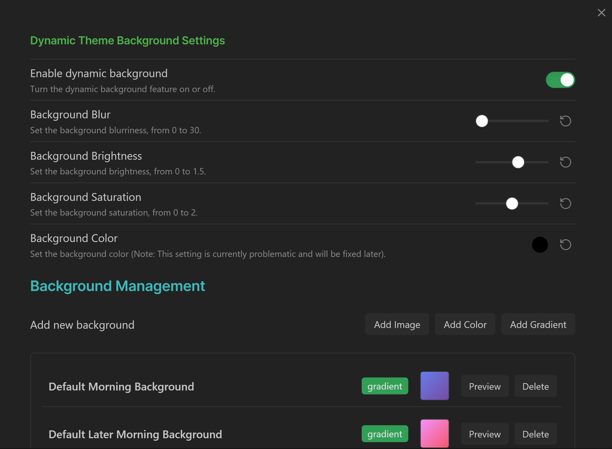
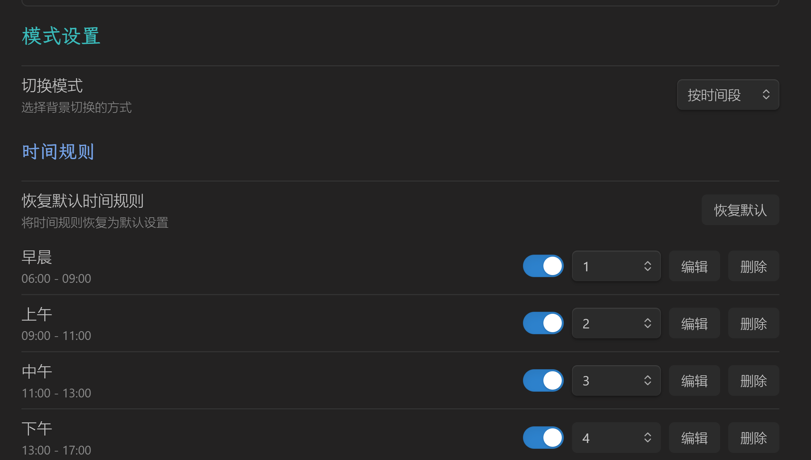

# Obsidian Dynamic Theme Background Plugin

## 介绍

这是一个用于 Obsidian 的插件，可以根据时间段和用户设置动态更改背景。

## 特性

- **时间段背景**: 根据时间段自动切换背景
- **手动切换**: 允许用户手动切换背景
- **自定义设置**: 用户可以自定义背景模糊度、亮度、饱和度和颜色
- **支持多种背景类型**: 包括图片、颜色背景和渐变背景，其中图片背景支持远程图片和仓库本地图片
- **可与已有主题兼容**: 该插件可以与现有的 Obsidian 主题一起使用（但会覆盖一些样式，详见[注意](#注意)）




## 安装

### 方法一：通过 Obsidian 插件市场安装

TODO：待 Obsidian 插件市场审核通过后

### 方法二：通过 BRAT 插件安装

1. 安装 [BRAT](https://github.com/TfTHacker/obsidian42-brat) 插件
2. 在 BRAT 插件中 Add beta plugin -> 输入本项目的 GitHub 地址 `https://github.com/sean2077/obsidian-dynamic-theme-background`，并安装
3. 在 Obsidian 中启用插件

### 方法二：手动安装
1. 下载插件的 main.js, manifest.json 和 style.css 文件
2. 将其放入 Obsidian 的插件文件夹 .obsidian/plugins/dynamic-theme-background/
   - 确保文件夹结构正确
3. 在 Obsidian 中启用插件

## 使用

- 在设置中配置插件
- 使用命令面板切换背景

## 注意

目前插件通过以下样式修改工作区背景，请知晓会覆盖已有主题样式的地方：

```css
.dtb-enabled {
    --background-primary: ${this.settings.bgColor} !important;
    --background-primary-alt: ${this.settings.bgColor} !important;
    --background-secondary: ${this.settings.bgColor} !important;
    --background-secondary-alt: ${this.settings.bgColor} !important;
    --tab-background-active: transparent !important;
    --tab-outline-width: transparent !important;
}
.dtb-enabled .workspace::before {
    ${backgroundProperty}: ${cssValue} !important;
    background-size: cover;
    background-repeat: no-repeat;
    filter: blur(${this.settings.blurDepth}px) brightness(${this.settings.brightness4Bg}) saturate(${this.settings.saturate4Bg});
    content: '';
    position: absolute;
    top: 0;
    left: 0;
    right: 0;
    bottom: 0;
    z-index: -1;
}
```

## 贡献

欢迎提交问题和功能请求！如果您想贡献代码，请遵循以下步骤：

1. Fork 本仓库
2. 创建新分支
3. 提交更改
4. 创建 Pull Request

## 许可证

参阅 [LICENSE](LICENSE) 文件。
